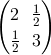

# degree2 [](http://www.gnu.org/licenses/gpl.html)

A Sage package for computation of degree 2 Siegel modular forms


## Installation
Here, we install the package in "~/sage\_packages/".

1. First install [Sage](http://www.sagemath.org/).

2. Create the directory and clone the repository.

    ```sh
    mkdir ~/sage_packages
    cd ~/sage_packages
    git clone https://github.com/stakemori/degree2.git
    ```
   Or
    [download this repository as a zip file](https://github.com/stakemori/degree2/archive/master.zip)
    , extract the zip file in "~/sage\_packages/" and rename the
    extracted directory name to `degree2`.

3. Put the following lines to "~/.sage/init.sage".

    ```python
    import sys
    import os
    sys.path.append(os.path.join(os.environ["HOME"], "sage_packages"))
    from degree2.all import *
    ```

## Basic Usage

* Siegel-Eisenstein of degree two can be obtained by the function
  `eisenstein_series_degree2`. Siegel-Eisenstein series is normalized
  so that the constant term is one.

    ```python
    sage: es4 = eisenstein_series_degree2(4, 10)
    sage: es4.prec
    10
    sage: es4[(2, 1, 3)]
    2903040
    ```
  The last line means that the Fourier coefficient of `es4` at the
  half integral symmetric matrix  is 2903040.
  The third lines means that `es4` knows Fourier coefficients of
  Siegel-Eisenstein series of weight 4
  at half integral matrices whose maximum value of diagonal entries are less than or equal to 10.

* Igusa's weight 10 , 12 and 35 cusp forms can be obtained by the
  function `x10_with_prec`, `x12_with_prec` and `x35_with_prec`
  respectively. These functions take one positive integer argument.
  The meaning of the argument is same as the attribute `prec` of
  `es4`, i.e. it means that the returned value knows the Fourier
  coefficients at half integral matrices whose maximum value of diagonal entries are less than or
  equal to the argument.

    ```python
    sage: x10 = x10_with_prec(10)
    sage: x12 = x12_with_prec(10)
    sage: x35 = x35_with_prec(10)
    sage: x10[(1, 1, 1)]
    1
    sage: x12[(1, 1, 1)]
    1
    sage: x35[(2, -1, 3)]
    1
    sage: x35[(5, 1, 4)]
    -759797709
    ```

* You can add and multiply modular forms by `+` and `*`.

    ```python
    sage: es4 = eisenstein_series_degree2(4, 10)
    sage: es8 = eisenstein_series_degree2(8, 10)
    sage: es4 + es4
    Siegel Modular form of weight 4 with prec = 10:
    {(0, 0, 0) : 2,
     (0, 0, 1) : 480,
     (1, 0, 0) : 480,
     (1, 0, 1) : 60480,
     ...
     (10, 0, 0) : 544320}
    sage: 2*es4 == es4 + es4
    True
    sage: es8 == es4 * es4
    True
    sage: es8 == es4^2
    True
    ```

* You can create the space of Klingen-Eisenstein series and
  cusp forms by the function
  `KlingenEisensteinAndCuspForms`.

    ```python
    sage: N47 = KlingenEisensteinAndCuspForms(47, 8)
    sage: N47.dimension()
    3
    sage: N47.prec
    8
    ```
    Here `N47` is the space of Klingen-Eisenstein series and cusp forms
    of weight 47, which is equal to the space of cusp forms of weight 47 because 47 is odd.
    Last line means each `prec` of the basis of `N47` is 8.

    You can compute the matrix of Hecke operator T(m) (m: a prime or a square of a prime) by
    the function `N47.hecke_matrix`.
    ```python
    sage: A = N47.hecke_matrix(2); A
    [      -69045420294144   8646128852105428992 -33244506086178816000]
    [              7688192       -53094861766656        17259429888000]
    [            -16719872        26329615958016       -58220441763840]
    sage: f = A.charpoly(); f
    x^3 + 180360723824640*x^2 + 9700267079136838378586112000*x + 157899144590481648119705809591468032000000
    sage: f.is_irreducible()
    True
    sage: K.<a> = NumberField(f); K
    Number Field in a with defining polynomial x^3 + 180360723824640*x^2 + 9700267079136838378586112000*x + 157899144590481648119705809591468032000000
    ```
    Here `f` is the characteristic polynomial of T(2) acting on `N47` and
    `K` is the number field generated by a root `a` of `f`.

    You can obtain an eigenform of weight 47 by the function `N47.eigenform_with_eigenvalue_t2`.
    ```python
    sage: x47 = N47.eigenform_with_eigenvalue_t2(a)
    ```
    Here `x47` is the weight 47 cusp form whose eigenvalue of T(2) is `a`.

    ```python
    sage: x47[(2, 1, 3)]
    9031680*a + 526277673739804999680
    sage: x47._construction
    (-16719872*a - 685312149824691240960)*es4^3*x35 + (7688192*a + 159034476084886241280)*es6^2*x35 + (a^2 + 111315303530496*a + 2636772146839387523556311040)*x12*x35
    ```
    The attribute `_construction` shows how `x47` is constructed as a
    polynomial of Siegel-Eisenstein series of weight 4, 6 and cusp
    forms of weight 10, 12 and 35.

## License
Licensed under the [GPL Version 3][GPL]
[GPL]: http://www.gnu.org/licenses/gpl.html
